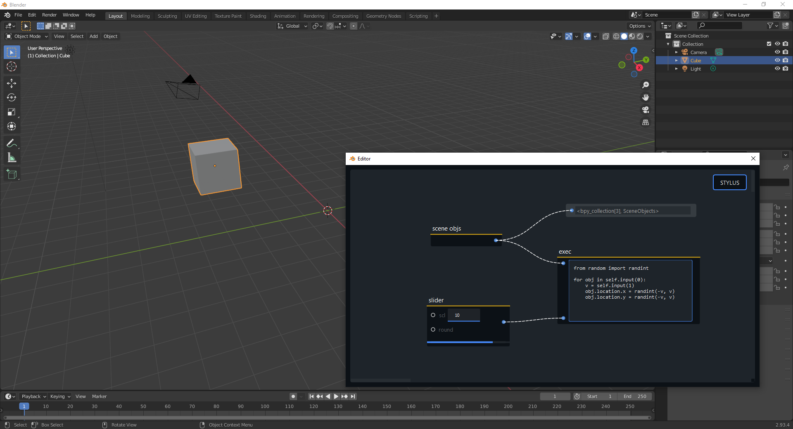

### Blender plugin for Ryven-like nodes editor

This repo can be used as Blender plugin to integrate a simple Ryven-like editor, but there are practically no nodes yet. **If you know the Blender Python API or want to get into it, please consider contributing by creating nodes**.

While Blender itself already has an impressive built-in node editor system, the simplicity of Ryven together with the extensive Blender Python API might enable extremely rapid development of new sophisticated nodes.



## setup

Using *Blender's local Python installation*, install [`ryvencore-qt`](https://github.com/leon-thomm/ryvencore-qt)

```
pip install ryvencore-qt
```

However, you probably have a global Python installation already on your system, so you might have to run this by manually specifying the paths to Blender's Python, like this

```
<BP>/<ver>/python/bin> python.exe "<BP>/<ver>/python/lib/site-packages/pip" install ryvencore-qt
```

where `<BP>` is the path to your Blender installation and `<ver>` is the version.

Then place this repository under `<BP>/<ver>/scripts/addons/` and restart blender. Under `Edit => Preferences => Add-ons` you should now find `Open Ryven Editor`. If not, click `install` and select the `ryven-blender/__init__.py` file.

By pressing `F3` in Blender you should now find `Open Ryven Editor` as command which simply shows the editor window, closing the Ryven editor window doesn't kill its content.