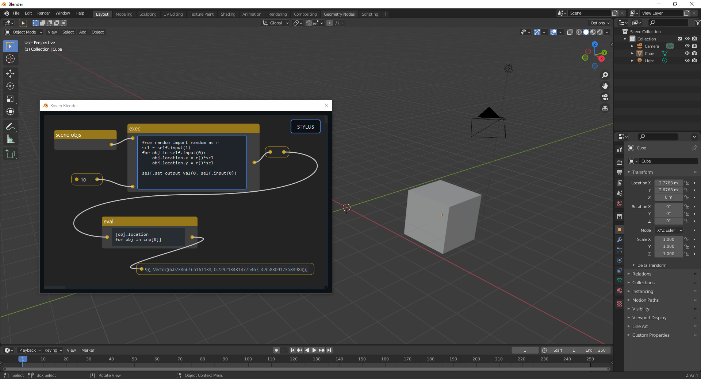

## Ryven plugin for Blender

This repo consists of a tiny file for loading [Ryven](https://github.com/leon-thomm/ryven) as a plugin in Blender, as well as nodes packages. **Notice that there are no nodes at all available yet, because I don't know the Blender Python API well**. If you do, please consider contributing.

While Blender itself already has an impressive built-in nodes-based material editor, the simplicity of Ryven together with the extensive Blender Python API might enable much more rapid development of new nodes.



## setup

### Step 1: Find the path to your Blender's Python executable

something like

```
C:\Program Files\Blender Foundation\Blender 2.93\2.93\python\bin\python
```

I will refer to the Blender Python path as `<BPP>` from now on.

### Step 2: Install Ryven and bqt

Run a terminal with admin/root privileges and execute

```
"<BPP>" -m pip install ryven
"<BPP>" -m pip install bqt
```

### Step 3: Add the plugin

Clone this repository into the addons dir of your Blender installation

```
cd <Blender-Path>/<ver>/scripts/addons/
git clone https://github.com/leon-thomm/ryven-blender
```

### Step 4: Load the plugin

Open Blender. Under `Edit => Preferences => Add-ons` you should now find `Open Ryven Editor`. If not, click `install` and select the `ryven-blender/ryven-blender.py` file.

By pressing `F3` in Blender you should now find `Open Ryven Editor` as command which simply shows the editor window, closing the Ryven editor window doesn't kill its content.

## troubleshooting

Blender's Python integration system seems quite bad. It comes with its own Python installation, which you need to use to install Ryven and dependencies, but when I try to use it myself I usually get all sorts of bugs and unintended behavior all the time. Frequently occurring issues:

- on Windows, Blender likes to randomly copy `ryven-blender.py` into a Roaming directory when the addon is loaded, and then it complains that there are conflicting addon versions (duh) --- **Fix**: no idea
- installing packages on Blender's python is a nightmare, sometimes the installed packages are existent and listed by pip but Blender itself cannot read them, sometimes the installation itself is broken leading to unfixable issues like the shiboken import issues that PySide2 had on Python 3.8.0 but here also on newer versions --- **Fix**: uninstall Blender, remove its folders (!) and install it again
- ryven complains to have no read/write permissions in its installation directory --- **Fix**: run Blender as administrator
- also notice, that paths given for modules from addons can be different from you would expect when loaded in Blender
